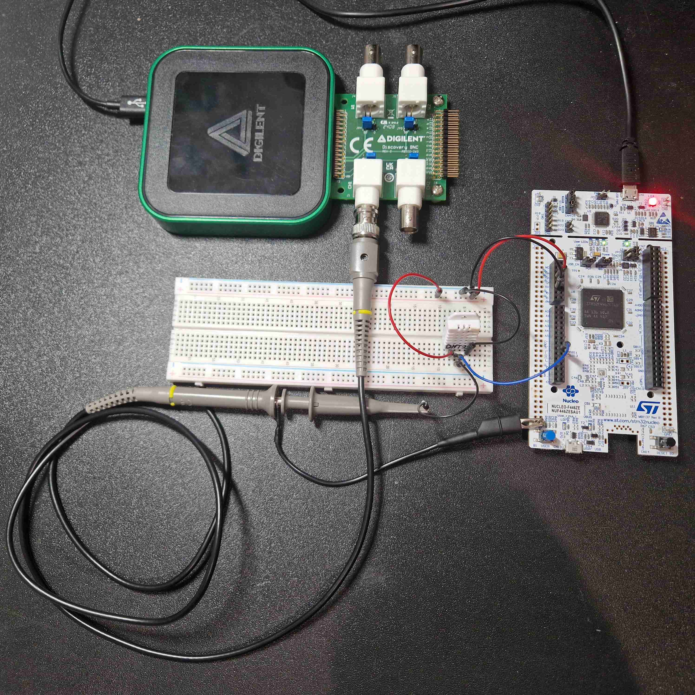
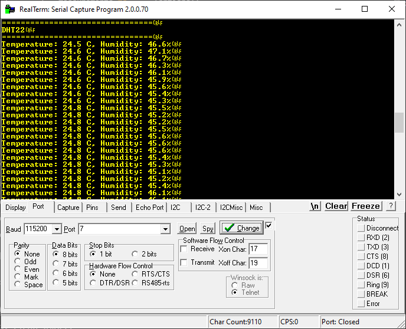
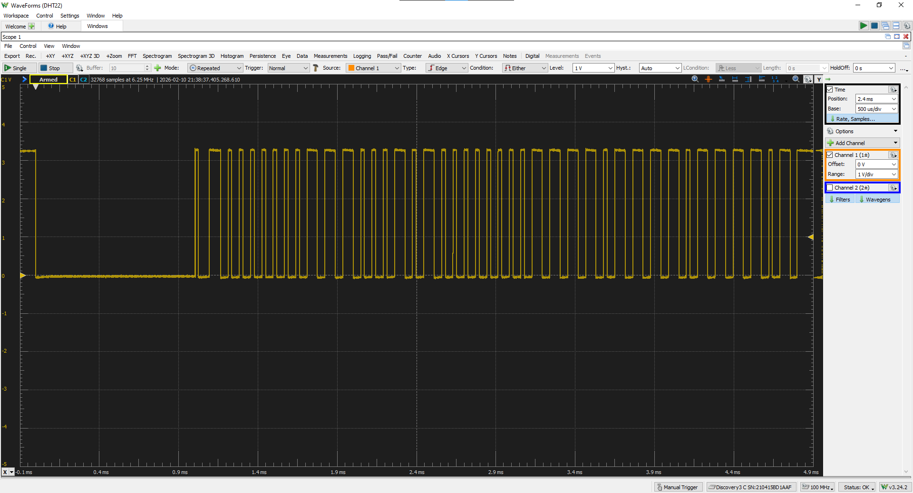

# stm32-dht22-input-capture

This project implements a temperature and humidity measurement system using a **DHT22 (AM2302)** sensor and an **STM32F446ZE** microcontroller.

It demonstrates two different approaches to decoding the DHT22 single-wire protocol:

- **v1.0** – GPIO bit-banging using a free-running 1 MHz timer for microsecond timing  
- **v2.0** – Hardware-assisted decoding using **TIM9 Input Capture** with an interrupt-driven finite state machine (FSM)

---

## Features

- Periodic sensor sampling every 5 s using **TIM6**
- Two DHT22 driver implementations:
  - **v1.0**: **Bit-banging** with a free-running microsecond counter
  - **v2.0**: **Input capture** with deterministic edge timestamping
- ISR-driven finite state machine for protocol decoding
- UART output over **USART3** (ST-Link Virtual COM Port)
- Register-level peripheral configuration (no HAL timing helpers)

---

## Hardware / Board

- **MCU / Board:** STM32F446ZE (NUCLEO-F446ZE)
- **Sensor:** DHT22 / AM2302
- **Pull-up resistor:** Required on the DHT22 data line (single-wire bus)
- **Host PC:** Serial terminal for UART output

### Pin mapping

| Signal | MCU Pin | Peripheral |
|------|--------|-----------|
| DHT22 Data | PE5 | GPIO / TIM9_CH1 (AF3) |
| Periodic Trigger | — | TIM6 |
| Protocol Timing | — | TIM9 |
| UART TX | PD8 | USART3 |
| UART RX | PD9 | USART3 |

---

## Firmware Architecture

### Design Goals
- Accurate microsecond-level timing
- Deterministic protocol decoding
- Minimal CPU load during measurements
- Clear separation between application logic and sensor driver

---

1. **TIM6 interrupt** triggers a sensor read request every 5 seconds  
2. `main()` initiates the read via `dht22_start_read()`  
3. The MCU drives the DHT22 data line low (~1 ms start pulse)  
4. PE5 is switched to **TIM9 input capture (AF3)**  
5. **TIM9 ISR** timestamps rising and falling edges and reconstructs the 40-bit frame  
6. The application validates checksum, converts values, and outputs results via UART  

---

### Version Comparison

#### v1.0 – Bit-Banging (Free-Running Timer)
- TIM9 used as a 1 MHz free-running counter
- GPIO polling with busy-wait loops
- Simple and functional
- Higher CPU load and sensitive to interrupt jitter

#### v2.0 – Input Capture (Current Version)
- TIM9 input capture timestamps signal edges in hardware
- ISR-driven finite state machine
- Deterministic timing and improved robustness
- Scalable design suitable for multitasking systems

---

## Releases / Milestones

- **v1.0-bitbang**  
  Initial working implementation using GPIO bit-banging and a free-running timer.

- **v2.0-input-capture** *(latest)*  
  Hardware-assisted DHT22 driver using TIM9 input capture and FSM-based decoding.

See the **Releases** section for tagged versions and detailed notes.

---

## Evidence / Measurements

### Hardware setup

### UART output (RealTerm)

### DHT22 waveform (Analog Discovery 3)

---

## Build & Run

1. Open the project in **STM32CubeIDE**
2. Build (Debug or Release configuration)
3. Flash to the NUCLEO-F446ZE board
4. Open a serial terminal:
   - **Baud rate:** 115200
   - **Format:** 8-N-1

Measured temperature and humidity values will be printed periodically.

---

## What This Project Demonstrates

- STM32 general-purpose timer usage
- Input capture configuration and polarity control
- Interrupt-driven finite state machine design
- Timing-critical single-wire protocol decoding
- Clean driver/API separation in embedded C
- Incremental design improvement and refactoring

